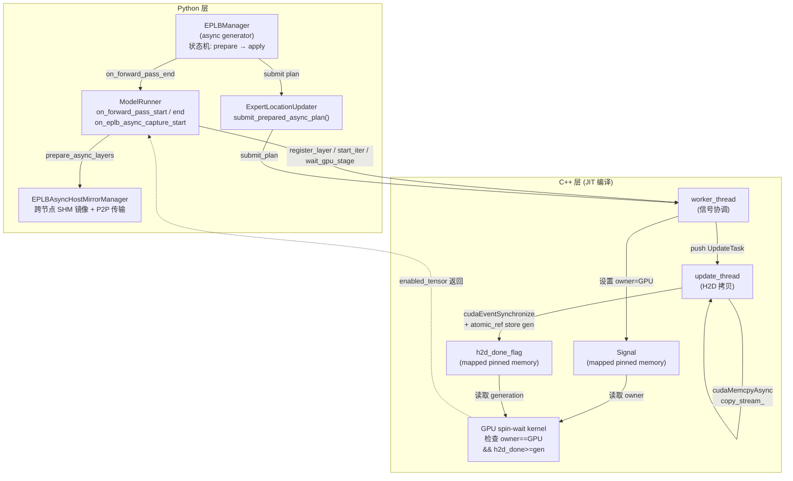
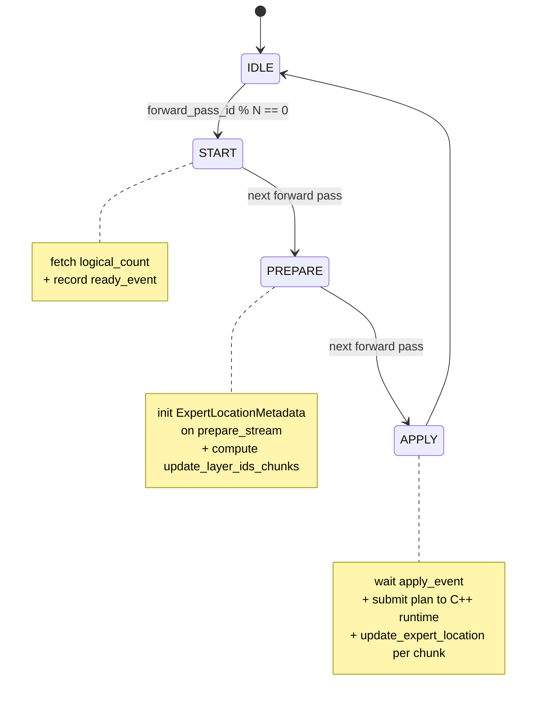
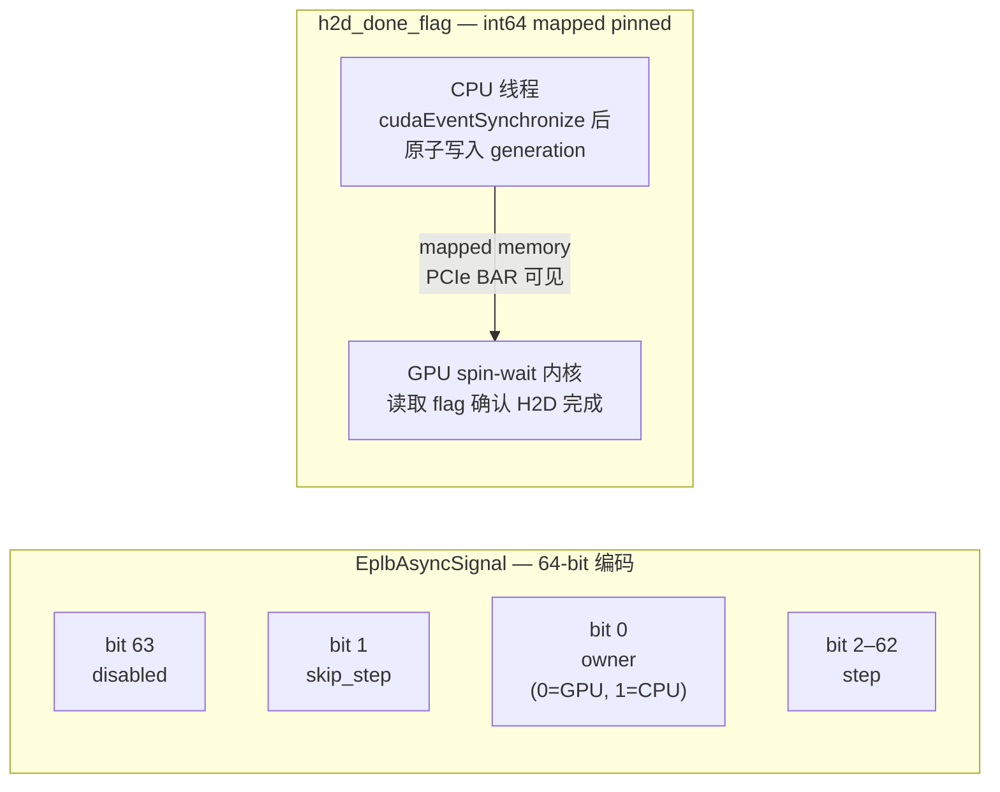
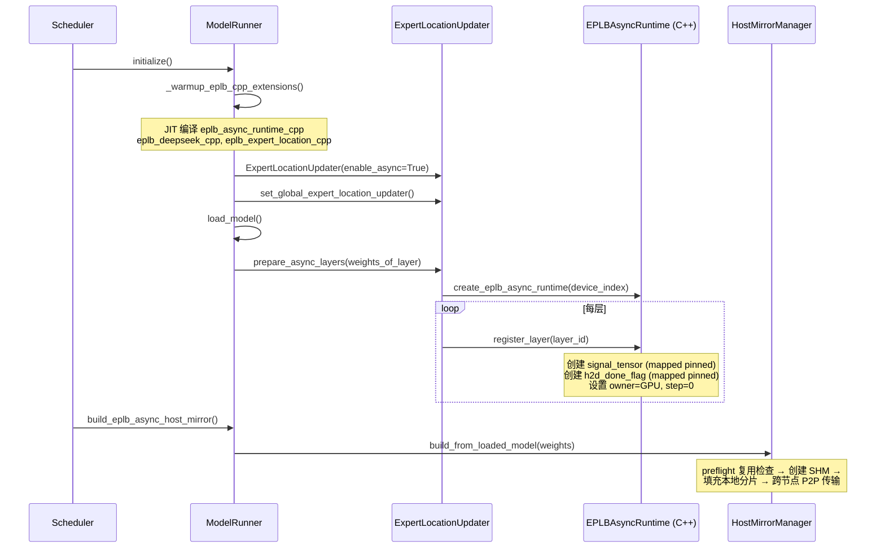
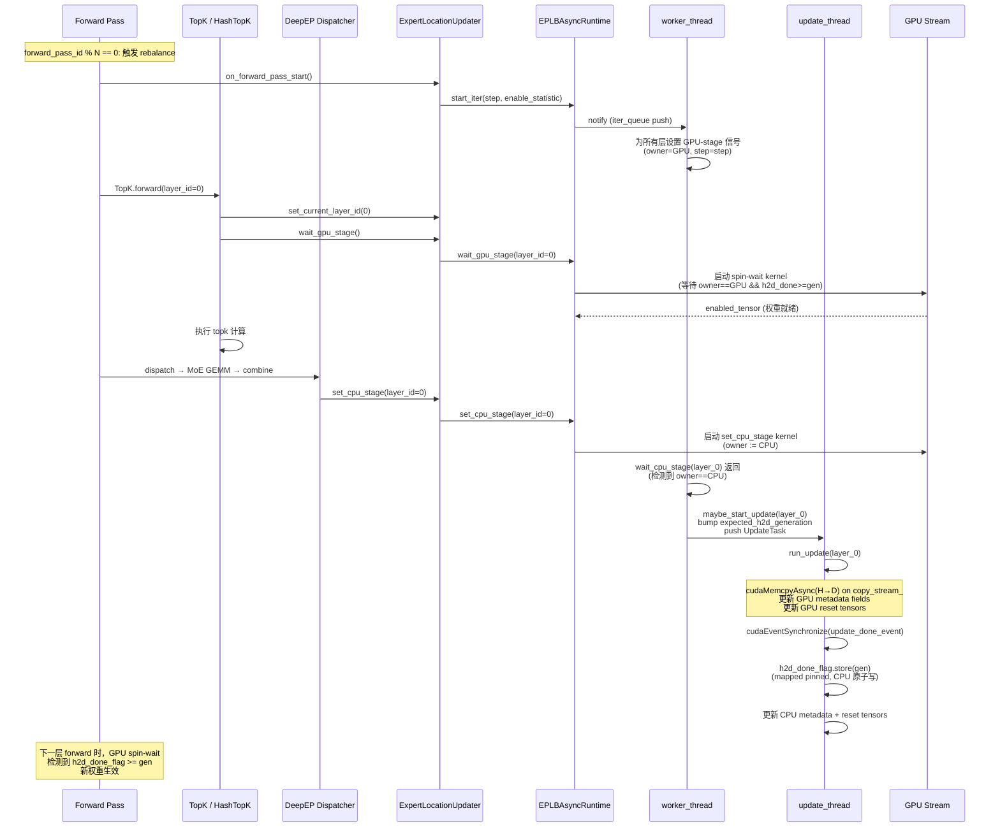
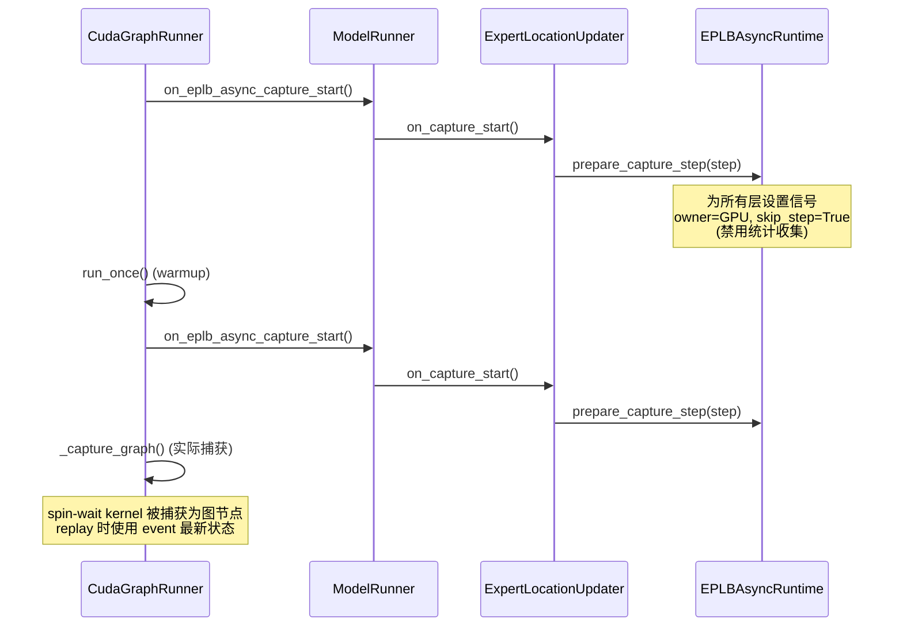

# EPLB Async: 异步专家权重迁移

## 概述

Commit `feat(eplb): [1/n]support EPLB-Async by using H2D
` 引入了 **EPLB-Async**（Expert Parallelism Load Balancer - Async）特性，通过 **Host-to-Device (H2D)** 异步拷贝机制实现 MoE 专家权重的在线重平衡。传统 EPLB 在每次 rebalance 时会阻塞推理流水线，而 EPLB-Async 将权重迁移的 H2D 拷贝解耦到独立的 C++ 线程中，利用 GPU 端自旋等待信号（spin-wait signal）实现无阻塞的权重切换。

本 commit 是 `[1/n]` 系列的第一个，建立了完整的异步运行时框架。

## 动机

传统 EPLB 的 rebalance 流程是同步的：

1. 收集专家激活统计 → 2. 计算 expert location plan → 3. **阻塞推理**，逐层拷贝权重 → 4. 恢复推理

步骤 3 中的权重拷贝涉及大量 H2D 传输（每个专家可达数十 MB），同步执行会导致显著的推理停顿。

EPLB-Async 的核心思想：**在推理继续运行的同时，后台线程异步地将新权重从 Host 内存拷贝到 GPU**。当 GPU 完成当前层的推理后，通过轻量级的信号机制确认新权重已就绪，即可无缝切换。

## 架构

### 整体架构图



### 核心组件

#### 1. EPLBAsyncRuntime（C++ 运行时）

位于 [eplb_async_runtime.cpp](/python/sglang/jit_kernel/csrc/eplb/eplb_async_runtime.cpp)，是整个异步机制的核心。它包含：

- **worker_thread**：协调每层推理与权重更新的时序。每个 forward iteration 开始时，为所有注册的层设置 GPU-stage 信号，然后等待 GPU 完成该层计算（CPU-stage 信号返回）。
- **update_thread**：执行实际的 H2D 权重拷贝。使用独立的 `copy_stream_` CUDA 流，通过 `cudaMemcpyAsync` 将 Host 镜像中的权重拷贝到 GPU。
- **信号机制**：基于 mapped pinned memory 的 `EplbAsyncSignal`，GPU 和 CPU 通过原子读写进行零拷贝通信。

关键数据结构：

<table style={{width: "100%", borderCollapse: "collapse", tableLayout: "fixed"}}>
  <colgroup>
    <col style={{width: "30%"}} />
    <col style={{width: "70%"}} />
  </colgroup>
  <thead>
    <tr style={{borderBottom: "2px solid #d55816"}}>
      <th style={{textAlign: "left", padding: "10px 12px", fontWeight: 700}}>结构</th>
      <th style={{textAlign: "left", padding: "10px 12px", fontWeight: 700}}>说明</th>
    </tr>
  </thead>
  <tbody>
    <tr>
      <td style={{padding: "9px 12px", fontWeight: 500}}><code>EplbAsyncSignal</code></td>
      <td style={{padding: "9px 12px"}}>64-bit 信号量，编码 step、owner（GPU/CPU）、skip_step、disabled 标志</td>
    </tr>
    <tr>
      <td style={{padding: "9px 12px", fontWeight: 500}}><code>RegisteredLayer</code></td>
      <td style={{padding: "9px 12px"}}>每层注册信息：信号张量、enabled_tensor、h2d_done_flag、generation counter</td>
    </tr>
    <tr>
      <td style={{padding: "9px 12px", fontWeight: 500}}><code>PreparedPlan</code></td>
      <td style={{padding: "9px 12px"}}>预计算的权重更新计划：update_layer_ids、LayerPlan、metadata fields、reset tensors</td>
    </tr>
    <tr>
      <td style={{padding: "9px 12px", fontWeight: 500}}><code>ActivePlan</code></td>
      <td style={{padding: "9px 12px"}}>已激活的计划，含原子引用计数的 remaining_updates</td>
    </tr>
  </tbody>
</table>

#### 2. EPLBAsyncHostMirrorManager（Host 权重镜像）

位于 [eplb_async_host_mirror.py](/python/sglang/srt/eplb/eplb_async_host_mirror.py)，维护所有专家权重的 Host 侧副本。

- **SHM（SharedMemory）镜像**：节点内 rank 0 创建共享内存段存储专家权重，其他 rank 通过 `attach` 复用。支持跨进程复用（`SGLANG_EPLB_ASYNC_HOST_MIRROR_REUSE_SHM`）。
- **跨节点 P2P 传输**：多节点场景下，通过 NCCL P2P（`isend`/`irecv`）将专家权重从源节点传输到目标节点的 Host 镜像。
- **构建流程**：preflight 复用检查 → 创建 SHM records → 填充本地节点分片 → 跨节点传输 → attach 到 GPU 可访问的 pinned memory。

#### 3. EPLBManager 异步入口（Python 状态机）

位于 [eplb_manager.py](/python/sglang/srt/eplb/eplb_manager.py)，通过 Python generator 实现三阶段状态机：



#### 4. ExpertLocationUpdater 异步路径

位于 [expert_location_updater.py](/python/sglang/srt/eplb/expert_location_updater.py)，负责：

- **`prepare_async_layers()`**：模型加载后，为每层注册到 C++ runtime（创建信号和 flag）。
- **`submit_prepared_async_plan()`**：将 Python 层计算好的 copy plan 转换为 C++ `PreparedPlan` 并提交。
- **`on_forward_pass_start()` / `on_capture_start()`**：在每次 forward 开始和 CUDA graph 捕获前通知 runtime。
- **`set_current_layer_id()` + `wait_gpu_stage()`**：在 TopK forward 中插入 GPU 自旋等待，确保该层权重就绪。
- **`set_cpu_stage()`**：在 DeepEP combine 后设置 CPU-stage 信号，通知 worker 线程该层 GPU 计算已完成。

#### 5. 信号机制详解

信号定义在 [eplb_async_signal_runtime.h](/python/sglang/jit_kernel/include/sgl_kernel/eplb_async_signal_runtime.h)：



**双信号协议**：

1. **GPU-stage 信号**：worker_thread 设置 `owner=GPU`，表示 GPU 可以开始使用当前权重。GPU 内核自旋等待 `owner==GPU` 且 `h2d_done_flag >= expected_generation`。
2. **CPU-stage 信号**：GPU forward 完成该层后（在 DeepEP combine 后），设置 `owner=CPU`，通知 worker 线程可以安全地开始该层的 H2D 更新。

## 时序图

### 初始化时序



### 正常推理 + 异步 Rebalance 时序



### CUDA Graph 捕获时序



## 配置

### Server Args

<table style={{width: "100%", borderCollapse: "collapse", tableLayout: "fixed"}}>
  <colgroup>
    <col style={{width: "32%"}} />
    <col style={{width: "20%"}} />
    <col style={{width: "48%"}} />
  </colgroup>
  <thead>
    <tr style={{borderBottom: "2px solid #d55816"}}>
      <th style={{textAlign: "left", padding: "10px 12px", fontWeight: 700}}>参数</th>
      <th style={{textAlign: "left", padding: "10px 12px", fontWeight: 700}}>默认值</th>
      <th style={{textAlign: "left", padding: "10px 12px", fontWeight: 700}}>说明</th>
    </tr>
  </thead>
  <tbody>
    <tr>
      <td style={{padding: "9px 12px", fontWeight: 500}}><code>--enable-eplb-async</code></td>
      <td style={{padding: "9px 12px"}}><code>False</code></td>
      <td style={{padding: "9px 12px"}}>启用异步 EPLB 权重迁移后端。必须与 <code>--enable-eplb</code> 同时使用。</td>
    </tr>
    <tr>
      <td style={{padding: "9px 12px", fontWeight: 500}}><code>--enable-eplb</code></td>
      <td style={{padding: "9px 12px"}}><code>False</code></td>
      <td style={{padding: "9px 12px"}}>启用 EPLB 算法。异步模式的前置条件。</td>
    </tr>
  </tbody>
</table>

### 环境变量

<table style={{width: "100%", borderCollapse: "collapse", tableLayout: "fixed"}}>
  <colgroup>
    <col style={{width: "45%"}} />
    <col style={{width: "15%"}} />
    <col style={{width: "40%"}} />
  </colgroup>
  <thead>
    <tr style={{borderBottom: "2px solid #d55816"}}>
      <th style={{textAlign: "left", padding: "10px 12px", fontWeight: 700}}>环境变量</th>
      <th style={{textAlign: "left", padding: "10px 12px", fontWeight: 700}}>默认</th>
      <th style={{textAlign: "left", padding: "10px 12px", fontWeight: 700}}>说明</th>
    </tr>
  </thead>
  <tbody>
    <tr>
      <td style={{padding: "9px 12px", fontWeight: 500}}><code>SGLANG_EPLB_ASYNC_HOST_MIRROR_REUSE_SHM</code></td>
      <td style={{padding: "9px 12px"}}><code>True</code></td>
      <td style={{padding: "9px 12px"}}>复用已存在的共享内存段，避免重复构建 host mirror。</td>
    </tr>
    <tr>
      <td style={{padding: "9px 12px", fontWeight: 500}}><code>SGLANG_EPLB_ASYNC_HOST_MIRROR_MEMORY_LOG</code></td>
      <td style={{padding: "9px 12px"}}><code>False</code></td>
      <td style={{padding: "9px 12px"}}>打印 host mirror 内存使用详情。</td>
    </tr>
    <tr>
      <td style={{padding: "9px 12px", fontWeight: 500}}><code>SGLANG_EPLB_ASYNC_DUMMY_H2D</code></td>
      <td style={{padding: "9px 12px"}}><code>False</code></td>
      <td style={{padding: "9px 12px"}}>使用 dummy 模式构建 host mirror（跳过实际 H2D），用于测试。</td>
    </tr>
    <tr>
      <td style={{padding: "9px 12px", fontWeight: 500}}><code>SGLANG_EPLB_KERNEL_OVERLAP_WITH_COMBINE</code></td>
      <td style={{padding: "9px 12px"}}><code>False</code></td>
      <td style={{padding: "9px 12px"}}>将 add_row 和 set_cpu_stage 内核分派到专用流（gather_stream / async_eplb_stream），与后续操作 overlap。False 时在当前流上顺序执行。</td>
    </tr>
    <tr>
      <td style={{padding: "9px 12px", fontWeight: 500}}><code>SGLANG_EPLB_ASYNC_SYNC_DEBUG</code></td>
      <td style={{padding: "9px 12px"}}><code>False</code></td>
      <td style={{padding: "9px 12px"}}>C++ 运行时调试日志。</td>
    </tr>
    <tr>
      <td style={{padding: "9px 12px", fontWeight: 500}}><code>SGLANG_EPLB_RUNTIME_NVTX</code></td>
      <td style={{padding: "9px 12px"}}><code>False</code></td>
      <td style={{padding: "9px 12px"}}>在 H2D 拷贝区域插入 NVTX range，用于性能分析。</td>
    </tr>
  </tbody>
</table>

### 使用示例

```bash Command
python3 -m sglang.launch_server \
    --model-path deepseek-ai/DeepSeek-V3 \
    --moe-a2a-backend deepep \
    --moe-runner-backend deep_gemm \
    --tp 8 --ep 8 \
    --enable-eplb \
    --enable-eplb-async
```

## 关键设计决策

### 1. 双信号协议避免死锁

`expected_h2d_generation` 的 bump 时机是关键：

- **不在 `start_cpu_new_iter` 中 bump**：如果提前 bump，GPU spin-wait 会看到新的 generation 但 H2D 尚未入队，同时 worker 卡在 `wait_cpu_stage` 等 GPU 信号——形成循环依赖。
- **在 `maybe_start_update` 中 bump**：此时 GPU 已完成该层（`wait_cpu_stage` 已返回），确保 H2D 任务即将入队，spin-wait 有界且不会死锁。

### 2. h2d_done_flag 使用 mapped pinned memory

H2D 完成通知不通过 CUDA event 或 kernel，而是通过 **mapped pinned memory 的原子写入**：

- CPU 线程在 `cudaEventSynchronize(update_done_event_)` 后，通过 `std::atomic_ref` 原子写入 generation。
- GPU spin-wait 内核通过 mapped device pointer 直接读取，无需额外 kernel launch。
- 这避免了在 `copy_stream_` 上额外启动 kernel 的开销。

### 3. Host Mirror 跨节点构建

多节点场景下，每个逻辑专家的权重可能只存在于一个节点上。Host Mirror Manager 通过以下步骤完成跨节点同步：

1. 构建 node availability 矩阵（基于 `physical_to_logical_map`）。
2. 计算跨节点传输计划（src_node → dst_node）。
3. 使用 NCCL P2P（`isend`/`irecv`）按 rank 并行传输。
4. NCCL 不支持的 dtype（如 uint16）通过 `view(uint8)` 转换。

### 4. EPLB 统计收集的异步适配

异步模式下，`all_reduce` 和 `reduce` 操作从全局 world group 改为 EP group：

- 同步模式：`torch.distributed.reduce(dst=0)` — 只有 rank 0 收集统计。
- 异步模式：`torch.distributed.all_reduce(group=eplb_group)` — 所有 EP rank 都获得完整统计，每个节点独立计算 plan。

### 5. 模型层上下文管理

通过 `with_current_layer()` 上下文管理器和 `disable_this_region()` 实现：

- **DeepSeek V4 主模型**：每层 forward 包裹在 `with_current_layer(i)` 中，使统计收集器知道当前层 ID。
- **DeepSeek V4 NextN**：包裹在 `disable_this_region()` 中，禁用 MTP 层的 EPLB 统计。
- **DeepSeek V2 combine_a**：包裹在 `with_current_layer()` 中，确保 combine 阶段的统计正确归属。

## 兼容性与约束

<table style={{width: "100%", borderCollapse: "collapse", tableLayout: "fixed"}}>
  <colgroup>
    <col style={{width: "40%"}} />
    <col style={{width: "60%"}} />
  </colgroup>
  <thead>
    <tr style={{borderBottom: "2px solid #d55816"}}>
      <th style={{textAlign: "left", padding: "10px 12px", fontWeight: 700}}>约束</th>
      <th style={{textAlign: "left", padding: "10px 12px", fontWeight: 700}}>说明</th>
    </tr>
  </thead>
  <tbody>
    <tr>
      <td style={{padding: "9px 12px", fontWeight: 500}}>仅支持 CUDA</td>
      <td style={{padding: "9px 12px"}}><code>--device cuda</code>，不支持 CPU/ROCm/NPU</td>
    </tr>
    <tr>
      <td style={{padding: "9px 12px", fontWeight: 500}}>必须与 <code>--enable-eplb</code> 同时使用</td>
      <td style={{padding: "9px 12px"}}>异步模式是 EPLB 的扩展后端</td>
    </tr>
    <tr>
      <td style={{padding: "9px 12px", fontWeight: 500}}>不兼容 Elastic EP</td>
      <td style={{padding: "9px 12px"}}><code>elastic_ep_backend</code> 必须为 None</td>
    </tr>
    <tr>
      <td style={{padding: "9px 12px", fontWeight: 500}}>不兼容 <code>update_weights_from_disk</code></td>
      <td style={{padding: "9px 12px"}}>异步模式下权重更新由 C++ runtime 接管</td>
    </tr>
    <tr>
      <td style={{padding: "9px 12px", fontWeight: 500}}>强制单 GPU/进程</td>
      <td style={{padding: "9px 12px"}}>自动设置 <code>SGLANG_ONE_VISIBLE_DEVICE_PER_PROCESS=1</code></td>
    </tr>
    <tr>
      <td style={{padding: "9px 12px", fontWeight: 500}}>MTP/NextN 层不支持 EPLB</td>
      <td style={{padding: "9px 12px"}}><code>routed_experts_weights_of_layer</code> 返回空 dict</td>
    </tr>
  </tbody>
</table>

## 代码参考

<table style={{width: "100%", borderCollapse: "collapse", tableLayout: "fixed"}}>
  <colgroup>
    <col style={{width: "48%"}} />
    <col style={{width: "52%"}} />
  </colgroup>
  <thead>
    <tr style={{borderBottom: "2px solid #d55816"}}>
      <th style={{textAlign: "left", padding: "10px 12px", fontWeight: 700}}>文件</th>
      <th style={{textAlign: "left", padding: "10px 12px", fontWeight: 700}}>说明</th>
    </tr>
  </thead>
  <tbody>
    <tr>
      <td style={{padding: "9px 12px", fontWeight: 500}}><code>eplb_async_runtime.cpp</code></td>
      <td style={{padding: "9px 12px"}}>C++ 异步运行时核心：双线程、信号机制、H2D 拷贝</td>
    </tr>
    <tr>
      <td style={{padding: "9px 12px", fontWeight: 500}}><code>eplb_async_signal_runtime.cu</code></td>
      <td style={{padding: "9px 12px"}}>CUDA 内核：GPU spin-wait 和 CPU-stage 信号设置</td>
    </tr>
    <tr>
      <td style={{padding: "9px 12px", fontWeight: 500}}><code>eplb_async_signal_runtime.h</code></td>
      <td style={{padding: "9px 12px"}}>信号编码/解码常量与内联函数</td>
    </tr>
    <tr>
      <td style={{padding: "9px 12px", fontWeight: 500}}><code>eplb_deepseek.cpp</code></td>
      <td style={{padding: "9px 12px"}}>C++ 实现的 DeepSeek EPLB rebalance 算法</td>
    </tr>
    <tr>
      <td style={{padding: "9px 12px", fontWeight: 500}}><code>eplb_expert_location.cpp</code></td>
      <td style={{padding: "9px 12px"}}>C++ 实现的 logical→physical 映射计算</td>
    </tr>
    <tr>
      <td style={{padding: "9px 12px", fontWeight: 500}}><code>eplb_async_host_mirror.py</code></td>
      <td style={{padding: "9px 12px"}}>Host 权重镜像管理：SHM 创建/复用、跨节点 P2P 传输</td>
    </tr>
    <tr>
      <td style={{padding: "9px 12px", fontWeight: 500}}><code>cpp_async_runtime.py</code></td>
      <td style={{padding: "9px 12px"}}>Python JIT 加载器和 C++ 对象的 Python 封装</td>
    </tr>
    <tr>
      <td style={{padding: "9px 12px", fontWeight: 500}}><code>cpp_deepseek.py</code></td>
      <td style={{padding: "9px 12px"}}>DeepSeek EPLB C++ 扩展的 Python 封装</td>
    </tr>
    <tr>
      <td style={{padding: "9px 12px", fontWeight: 500}}><code>cpp_expert_location.py</code></td>
      <td style={{padding: "9px 12px"}}>Expert location C++ 扩展的 Python 封装</td>
    </tr>
    <tr>
      <td style={{padding: "9px 12px", fontWeight: 500}}><code>eplb_manager.py</code></td>
      <td style={{padding: "9px 12px"}}>EPLB 管理器：异步状态机（prepare→apply）</td>
    </tr>
    <tr>
      <td style={{padding: "9px 12px", fontWeight: 500}}><code>expert_location_updater.py</code></td>
      <td style={{padding: "9px 12px"}}>权重更新器：异步 plan 提交、层注册、信号同步</td>
    </tr>
    <tr>
      <td style={{padding: "9px 12px", fontWeight: 500}}><code>expert_distribution.py</code></td>
      <td style={{padding: "9px 12px"}}>专家分布统计：Triton add_row 内核、EP group reduce</td>
    </tr>
    <tr>
      <td style={{padding: "9px 12px", fontWeight: 500}}><code>expert_location.py</code></td>
      <td style={{padding: "9px 12px"}}>ExpertLocationMetadata：C++ EPLB 路径、pinned memory 优化</td>
    </tr>
    <tr>
      <td style={{padding: "9px 12px", fontWeight: 500}}><code>topk.py / hash_topk.py</code></td>
      <td style={{padding: "9px 12px"}}>TopK 层集成：layer_id 传递、wait_gpu_stage 插入</td>
    </tr>
    <tr>
      <td style={{padding: "9px 12px", fontWeight: 500}}><code>deepep.py</code></td>
      <td style={{padding: "9px 12px"}}>DeepEP dispatcher：masked_m 缓存、set_cpu_stage 插入</td>
    </tr>
    <tr>
      <td style={{padding: "9px 12px", fontWeight: 500}}><code>model_runner.py</code></td>
      <td style={{padding: "9px 12px"}}>ModelRunner 集成：warmup、host mirror 构建、forward hooks</td>
    </tr>
    <tr>
      <td style={{padding: "9px 12px", fontWeight: 500}}><code>cuda_graph_runner.py</code></td>
      <td style={{padding: "9px 12px"}}>CUDA Graph 捕获前调用 on_eplb_async_capture_start</td>
    </tr>
    <tr>
      <td style={{padding: "9px 12px", fontWeight: 500}}><code>deepseek_v2.py / v4.py / v4_nextn.py</code></td>
      <td style={{padding: "9px 12px"}}>模型层适配：layer 上下文管理器、is_nextn 标记</td>
    </tr>
    <tr>
      <td style={{padding: "9px 12px", fontWeight: 500}}><code>server_args.py</code></td>
      <td style={{padding: "9px 12px"}}><code>--enable-eplb-async</code> 参数与约束校验</td>
    </tr>
    <tr>
      <td style={{padding: "9px 12px", fontWeight: 500}}><code>environ.py</code></td>
      <td style={{padding: "9px 12px"}}>新增 6 个 EPLB-Async 相关环境变量</td>
    </tr>
  </tbody>
</table>

## 变更统计

本 commit 共修改 **27 个文件**，新增 **3987 行**，删除 **72 行**：

| 类型 | 文件数 | 说明 |
|------|--------|------|
| 新增 C++ 文件 | 5 | 异步运行时、信号内核、EPLB 算法 C++ 实现 |
| 新增 Python 文件 | 3 | cpp_async_runtime、cpp_deepseek、cpp_expert_location |
| 新增 Python 文件 | 1 | eplb_async_host_mirror (1352 行) |
| 修改 Python 文件 | 18 | EPLB manager、updater、distribution、models、topk 等 |
